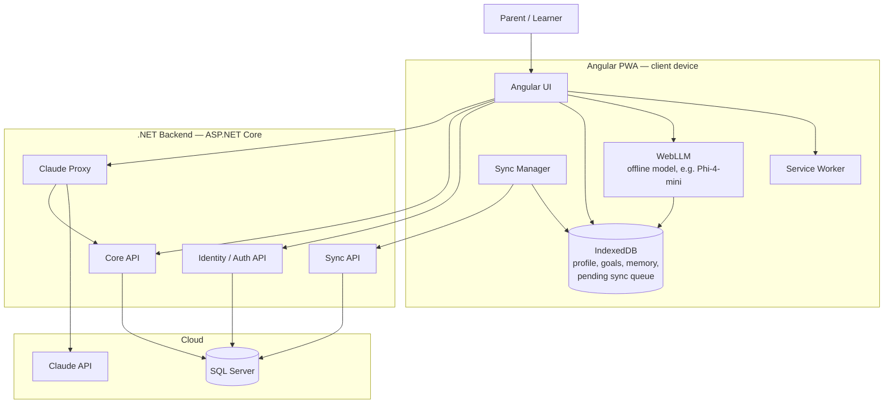
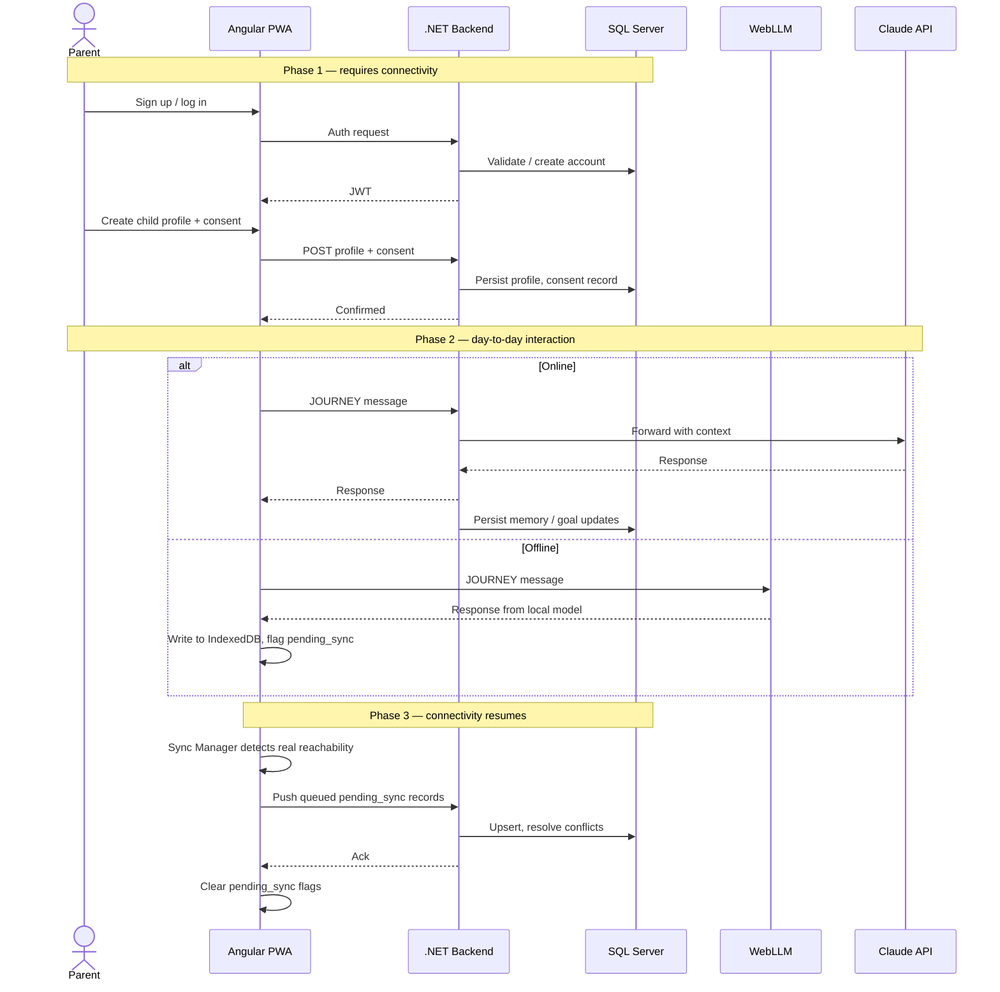

# LearnBridge — Architecture

## Component architecture

## Online setup → offline interaction → auto-sync

## Notes

- **Connectivity detection**: don't trust `navigator.onLine` alone — it only reports a network interface, not real reachability. Pair it with a lightweight health-check ping to the backend before deciding which backend (Claude Proxy vs. WebLLM) to route a JOURNEY message to.
- **Claude API key isolation**: the key lives only in the .NET Claude Proxy. Nothing in the Angular bundle, service worker, or IndexedDB should ever contain it.
- **Offline persona**: the local model does not reuse JOURNEY's full online system prompt as-is. Small quantized models follow nuanced multi-part instructions worse than Claude — give the offline path a separate, shorter, more directive system prompt scoped to encouragement, goal recall, and simple cached-content Q&A, not open-ended coaching.
- **Data model**: `learners`, `parental_consent`, `learning_profile`, `goals`, `journey_memory`, `conversation_sessions`, `access_audit_log` — same shape as the original data-layer spec, implemented as EF Core entities against SQL Server. Access control (who can read/write which rows) is enforced through ASP.NET Core authorization policies rather than database-native row-level security, since SQL Server RLS is heavier to maintain via EF Core migrations than policy-based authorization in the API layer — enforce it there, consistently, on every endpoint.
- **Sync conflicts**: last-write-wins is the default per `CLAUDE.md`. This is only safe because of the single-learner, single-primary-device assumption — revisit if a learner is ever expected to use JOURNEY from two devices without connectivity between them.
