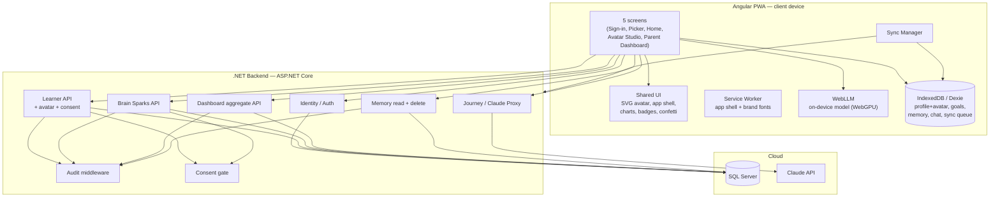
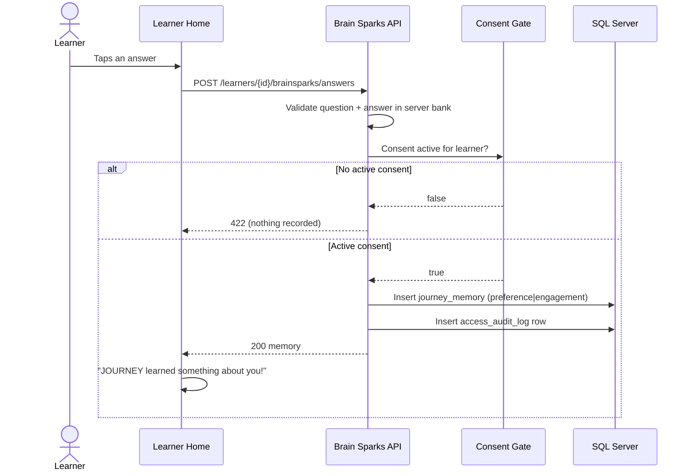

# Feature — JOURNEY Companion Experience & Parent Dashboard

**Status:** Implemented (frontend + backend), merged to `main`. Pixel/QA pass on the
three shell pages still recommended before the investor demo.
**Owners:** LearnBridge / Winterborne Consulting engagement.
**Related docs:** [`ARCHITECTURE.md`](./ARCHITECTURE.md) · [`../PLAN.md`](../PLAN.md) · [`../CLAUDE.md`](../CLAUDE.md)

---

## 1. Summary

This feature turns the functional LearnBridge app into a polished, demo-ready product
experience without changing any of the non-negotiable compliance behaviour. It delivers
five screens on a single token-driven design system:

1. **Sign-in** — one form for both roles (parent email / learner username), with an avatar hero.
2. **"Who's learning today?" profile picker** — large avatar cards per child.
3. **Learner Home** — an avatar companion beside the JOURNEY chat, a quest board, a
   streak + badge shelf, and **Brain Sparks** (quick preference questions).
4. **Avatar Studio** — a joyful SVG avatar builder.
5. **Parent Dashboard** — progress stats, the reviewable memory repository, an activity
   timeline, and family/device + consent controls.

It is built for cheap, low-memory Android phones and for full offline operation: all
illustration and charts are inline SVG, all motion is CSS transform/opacity, and the
device GPU is reserved for the on-device AI model rather than spent on UI effects.

---

## 2. Goals & non-goals

**Goals**
- A "wow-factor" learner experience that is exciting and interactive for a 7–14-year-old.
- Let JOURNEY learn from a child's *behaviour and preferences*, not just their answers to
  learning tasks (Brain Sparks).
- Give parents a trustworthy, information-dense view of progress, what JOURNEY has learned,
  and full control over consent and stored data.
- Keep everything fast and functional on low-end mobile hardware, online and offline.

**Non-goals**
- No 3D, WebGL, canvas, Lottie, video, or heavyweight chart/animation libraries.
- No new data categories about a minor — no feelings, mood, health, or family fields.
- No offline-only account creation or first login (still online-only by design).

---

## 3. User roles & primary flows

| Role | Signs in with | Lands on | Can reach |
|---|---|---|---|
| **Parent** | Email | Profile picker | Any child's Home, Avatar Studio, Parent Dashboard |
| **Learner** | Username (set by parent) | Their own Learner Home | Their Home + Avatar Studio |

**Flows**
- **Onboarding (online-only):** parent registers → creates child profile + captures consent
  + sets the child's username/password in one step.
- **Daily learner use:** pick profile → Learner Home → chat with JOURNEY, work quests,
  answer Brain Sparks, customise avatar. Works online (Claude) and offline (on-device model).
- **Parent review:** open a child's dashboard → see progress, review/remove individual
  memories, read the activity timeline, toggle consent.
- **Sign-out:** available in the app-shell header on every page for both roles (hidden while
  offline, so the cached session the device needs is never cleared without connectivity).

---

## 4. Feature detail

### 4.1 Avatar companion & Avatar Studio
- A layered **inline-SVG** avatar: skin, hair (short/curly/long), eyes, accessory
  (none/glasses/headphones/cap), outfit colour, and a companion theme colour that subtly
  re-tints the Home screen.
- Four expression states driven purely by **CSS class swaps** (no JS timers, no canvas):
  - `idle` — gentle breathing + blink loop
  - `thinking` — subtle bob while JOURNEY is generating
  - `celebrating` — bounce + confetti on goal completion
  - `sleepy` — droopy eyes / slower breath when the device is offline
- Avatar Studio saves the whole configuration as one JSON blob to the backend and refreshes
  the offline cache, so the avatar renders everywhere — Home, picker, dashboard — online and off.

### 4.2 Learner Home
- Avatar companion beside a warm bubble chat with markdown rendering and a typing indicator.
- **Offline banner** with the on-device model download/progress affordance
  ("Getting JOURNEY ready for offline… N%").
- **Quest board** — goals as cards with progress rings; `Abandoned` is shown as "Paused".
- **Streak + badge shelf** — day-streak and SVG badges whose earned state is derived from
  streak, completed goals, offline readiness, and Brain Spark participation.
- **Brain Sparks** — a floating card that pops a quick, fun preference question
  (this-or-that / would-you-rather / poll). One-tap answer → "JOURNEY learned something
  about you!". Copy is strictly about *how the child likes to learn* — never feelings,
  mood, health, or family (enforced server-side, see §7).

### 4.3 Parent Dashboard
- **Stat tiles** with 7-day sparklines: streak, sessions, active/completed goals, learning minutes.
- **Progress** — goal-completion area chart and a category breakdown bar chart (inline SVG).
- **What JOURNEY has learned** — the memory repository grouped into exactly four categories
  (Academic, Preference, Engagement, Goal-related), each item removable, with a standing
  trust note that feelings/health/family are never recorded.
- **Activity history** — a unified timeline mixing session, goal, and Brain Spark events.
- **Family & devices** — child card with a consent toggle (revoke requires a confirmation
  step) and offline-readiness status.

---

## 5. Architecture

This feature sits on top of the existing LearnBridge architecture (see
[`ARCHITECTURE.md`](./ARCHITECTURE.md) for the authoritative component and sequence
diagrams). Nothing about the online/offline/sync topology changed; the feature adds new
read/aggregate endpoints, one cosmetic write, and one behavioural write (Brain Sparks).

### 5.1 Component view (with this feature's additions)

### 5.2 Brain Spark answer — request flow

### 5.3 Frontend structure
- **Design tokens** live as CSS custom properties in `src/styles.scss` (colours, radii,
  shadows, spring/smooth easings, type families) — the single source of truth ported from
  the approved design. `prefers-reduced-motion` disables all avatar/confetti animation.
- **Shared standalone components** (`src/app/shared/`): `AvatarComponent` + `avatar-config.ts`,
  `AppShellComponent` (header + bottom nav + sign-out), `ConnectionPillComponent`,
  `ProgressRingComponent`, `SparklineComponent`, `BadgeIconComponent`, `ConfettiComponent`.
- **Feature pages** (`src/app/features/`): `auth/login-page`, `learners/learners-page`
  (picker), `journey/chat-page` (Learner Home), `avatar/avatar-studio-page`,
  `parent/parent-dashboard-page`.
- **Services** (`src/app/core/`): existing `AuthService`, `LearnerService` (extended with
  `updateAvatar` / `setConsent`), `JourneyService`, plus new `DashboardService`
  (dashboard, Brain Sparks, memory delete). Offline cache extended to store the avatar.

---

## 6. Backend API surface (added by this feature)

All routes require authentication; learner-scoped routes enforce the `LearnerDataAccess`
authorization policy (a learner may touch only their own rows; a parent only their
children's). Every learner-linked read/write emits an `access_audit_log` row.

| Method | Route | Purpose | Consent-gated | Notes |
|---|---|---|---|---|
| `PUT` | `/api/learners/{id}/avatar` | Save avatar config | No¹ | Validates JSON, ≤ 4000 chars |
| `PUT` | `/api/learners/{id}/consent` | Grant / revoke consent | — | Parent-only; revoke = soft delete |
| `DELETE` | `/api/learners/{learnerId}/memories/{memoryId}` | Remove one memory | — | Parent-only; hard delete, audited |
| `GET` | `/api/brainsparks` | List the question bank | — | Preference/Engagement copy only |
| `POST` | `/api/learners/{learnerId}/brainsparks/answers` | Record an answer | **Yes** | Writes a `journey_memory` row |
| `GET` | `/api/learners/{learnerId}/dashboard` | Aggregate stats + timeline | No | Reads sessions/goals/memory |

¹ The avatar is cosmetic self-expression, not learning data, so it is deliberately *not*
consent-gated (constraint 2 covers `learning_profile`, `goals`, `journey_memory`). Reads
and writes are still audited.

### Data model addition
- `Learner.AvatarConfig` — nullable JSON string, migration `AddLearnerAvatarConfig`. Opaque
  to the server. Everything else reuses existing tables (`journey_memory`, `goals`,
  `conversation_sessions`, `parental_consent`, `access_audit_log`).

The dashboard aggregation (streak, 7-day session/minute series, 12-week goal completion,
memory-category counts, offline-session count, activity timeline) is computed by a pure,
unit-tested `DashboardCalculator` so the maths is testable without a database.

---

## 7. Compliance & privacy (non-negotiable)

These are enforced in code, not just UI:

1. **Consent gates every learning-data write.** Brain Spark answers are refused with `422`
   when consent is inactive; the write gates read live consent state on each request.
2. **Closed memory category enum.** `journey_memory.category` remains exactly
   `academic | preference | engagement | goal_related`. Brain Spark answers may only land in
   `preference` or `engagement`. Guarded by `BrainSparkQuestionBankTests` and
   `JourneyMemoryCategoryTests`.
3. **No feelings/health/family, anywhere.** The Brain Spark question bank is server-curated
   and the test suite rejects any question whose copy references those topics. No such
   fields exist in the schema.
4. **Full audit trail.** Every learner-linked read/write (avatar, Brain Spark, dashboard,
   memory delete, consent) marks an `access_audit_log` access.
5. **Claude key isolation & online-only onboarding** are unchanged and still hold.

---

## 8. Device & browser requirements

### 8.1 Minimum (online use)
- **Any modern mobile or desktop browser** — Chrome/Edge/Firefox/Safari, last ~2 years.
- Roughly **1 GB RAM** free; the UI is intentionally light (no heavy runtime libraries,
  inline-SVG charts, CSS-only motion).
- Network for sign-in, account/profile creation, and cloud (Claude) conversations.
- **PWA install** and offline app-shell caching require a service-worker-capable browser
  (all of the above qualify). Brand fonts are cached for offline use.

### 8.2 Offline JOURNEY (on-device model)
The offline conversational model runs client-side via **WebLLM over WebGPU**.

| Requirement | Detail |
|---|---|
| **GPU API** | `navigator.gpu` (WebGPU) must be present and expose a usable adapter |
| **Browser** | Chrome/Edge **113+**, or another browser with WebGPU enabled |
| **Model** | `Llama-3.2-1B-Instruct` (chosen for mobile viability over larger models) |
| **GPU / unified memory** | ~**0.9 GB** for the `q4f16` build (needs the `shader-f16` feature); ~**1.1 GB** for the `q4f32` fallback on GPUs without `shader-f16` |
| **Download / storage** | One-time model download (~hundreds of MB to ~1 GB), then cached in-browser for offline reuse |
| **Feature detection** | The app probes the GPU adapter and picks the f16 or f32 build automatically |

**Graceful degradation:** on a device with no WebGPU or no usable adapter, the app does
**not** attempt to load a model. It falls back to cached-content-only offline mode — the
learner still sees their profile, goals, avatar, and saved transcript, and can reconnect to
use cloud JOURNEY. A parent can pre-verify a device with the **"Check offline readiness"**
action, which probes the GPU and pre-downloads the model.

### 8.3 Recommended for the demo / target device
- A phone/tablet with WebGPU support and **≥ 2 GB RAM** for comfortable headroom.
- **Pre-load the offline model over good wifi before going offline** — never first-load it
  over a live demo connection (see `PLAN.md` Phase 6).

---

## 9. Performance budget

- **No** 3D, WebGL, canvas, Lottie, video backgrounds, or chart/animation libraries.
- All illustration, avatars, badges, sparklines, rings, and charts are **inline SVG**.
- All motion is **CSS transform/opacity**; `prefers-reduced-motion` is honoured.
- The device GPU is reserved for the on-device model, not UI effects.
- Component styles are budgeted in `angular.json`; lazy-loaded routes keep the initial
  bundle small (the WebLLM runtime is dynamically imported only when needed).

---

## 10. Testing & verification status

- **Backend:** unit tests green, incl. `BrainSparkQuestionBankTests` (category + forbidden-topic
  guards) and `DashboardCalculatorTests` (streak, series, timeline). All new endpoints
  exercised end-to-end over real HTTP against LocalDB, including the consent gate
  (`422` when revoked → `200` after re-grant) and soft-delete behaviour.
- **Frontend:** unit tests green (the Learner Home spec renders the full new template);
  AOT `ng build` and `ng serve` compile all routes with zero errors; SPA boots and serves.
- **Outstanding:** a visual/QA click-through of the three app-shell pages (Learner Home,
  Avatar Studio, Parent Dashboard) — these were compile- and unit-verified but not
  pixel-captured in the build environment.

---

## 11. Known follow-ups
- Brain Spark answers are recorded **online only**; an offline answer queue (like the
  goals/memory sync path) would let them be captured without connectivity.
- Dashboard "topics explored" is currently derived from the memory-category mix; a richer
  topic taxonomy could be introduced if the schema gains a (non-sensitive) topic tag.
- Visual QA pass + real-device offline model load test before the investor demo.
